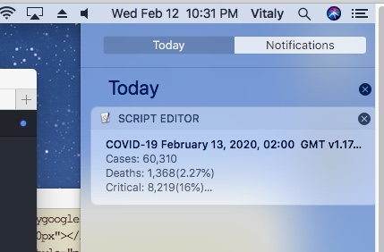

# wuhan_stats
Simple alert for updates of Wuhan virus statistics.

Generates alert using the Notifications feature on Mac or Windows as soon as new statistics are available on https://www.worldometers.info/coronavirus/  

## Dependencies:
- requests
- BeautifulSoup
- plyer

## To install:
*'pip install wuhan_stats'*

## To run:

*'nohup python -m wuhan-stats &'* (Mac)

*'pythonw -m wuhan_stats'*        (Windows)

## Notes
Polling period is 1 hour (hardcoded).

Alert is generated only if there is a new timestamp on the source site in 'Last updated' field.

For Windows, the notification's timeout is 1 hour.
For Mac, make sure desired notification style is choosen for Script Editor in System Preferences->Notifications.  
